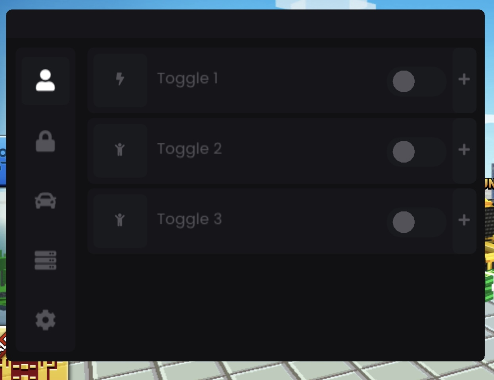

# Jailed ImGui Mod Menu



## Requirements

* Game's IPA file
* Theos
* Sideloadly
* File sharing enabled on sideloadly

### Setting Up

* Change the base64 string for the icon to your own in Menu.mm
```
NSString *baseimage = @"";
```
* Change the BinaryName to yours in Mods.mm
```
char* BinaryName = "executableName"; //if app uses default executable

//or if its a unityframework app
char* BinaryName = "Frameworks/UnityFramework.framework/UnityFramework";
```

* Add variables for cheats in the struct in Mods.h
```
struct Mods {
    bool bool1 = false, bool2 = false, bool3 = false;
    std::string myText = "Initial Text";
    float floatVal = 0;
    int intval = 0, intval2 = 0;
};
``` 

### Usage 

* UI elements are added in Menu.mm

* Main Switch Widget
```
// Having the same name is important
newChildVisible = childVisibilityMap["Toggle 1"];
ToggleWidget(ICON_FA_BOLT, "Toggle 1", & mods.bool1, & newChildVisible);
childVisibilityMap["Toggle 1"] = newChildVisible;
```

* Widget Slide View
```
// use the same name as your widget name
if (widgetName == "Toggle 1") {
    // Content for Toggle 1
}
else if (widgetName == "Toggle 2") {
    // Content for Toggle 2
}
else if (widgetName == "Toggle 3") {
    // Content for Toggle 3
}
```

* Inside of the slide view you can add these your other widgets such as these (More are to come)
```
ToggleButtonMini("Toggle A", & toggleValue);
```
``` 
SliderFloatMini("SliderFloat", & mods.floatVal, 0.0f, 500.0f);
```
```
SliderIntMini("SliderInt", & mods.intval, 0, 500);
```
```
IntInputMini("IntInput", & mods.intval2, 0, 100);
```
```
TextInputMini("TextInput", mods.myText, false);
```

* In Mods.mm you add your hooks and code patches (examples in Mods.mm)
```
HOOK(0x0000000, HookFunction, old_HookFunction);
HOOKPTR(0x0000000, FunctionPointer);
PATCHOFFSET(0x0000000, "00008052C0035FD6", true);
```

* You can use PATCHOFFSET like this to make it toggleable
```
if (mods.bool1) {
    PATCHOFFSET(0x0000000, "00008052C0035FD6", true);
}else
{
    PATCHOFFSET(0x0000000, "00008052C0035FD6", false);
}
```

* When you hook or patch a function, you need to run your tweak in the app and then go to the files app in the On My IPhone directory and then go to your game's folder. Then in the static-inline-hook folder your patched binary will be there. Replace the old one in the IPA file with this one for the cheats to work. The cheats will do nothing until you replace the patched binary and re-sideload your app.

## Credits

* This is a heavily modified version of CarsonArk's template
* Hooking from ItsPow45
* I made all the widgets, menu ui, icon animations, ptr and patch macro


## Version History

* 0.1
    * Initial Release
